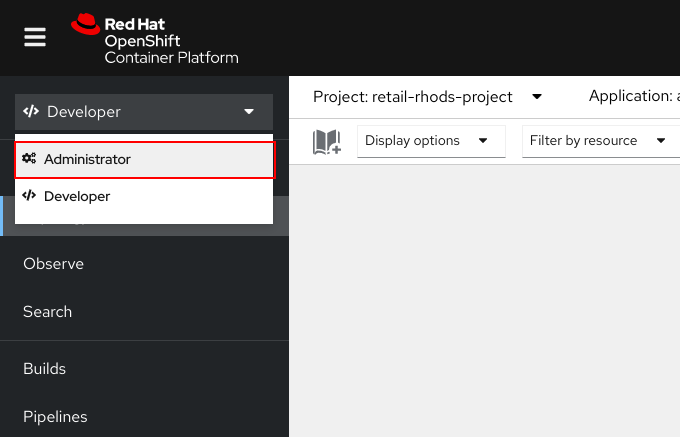
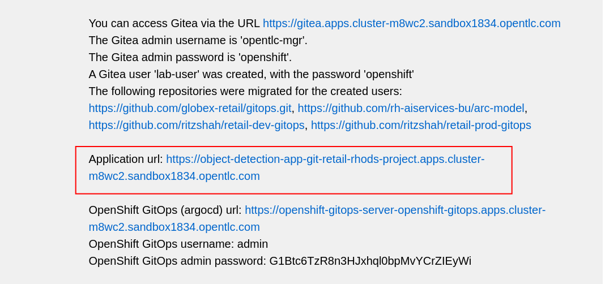
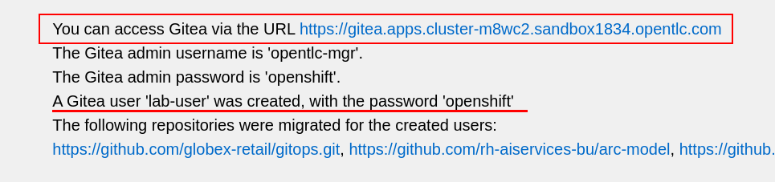
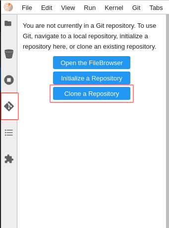
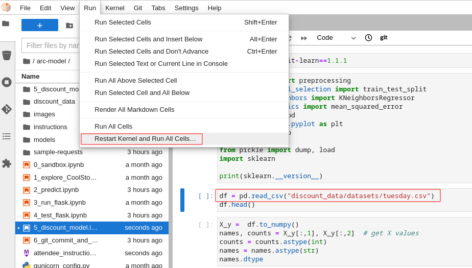
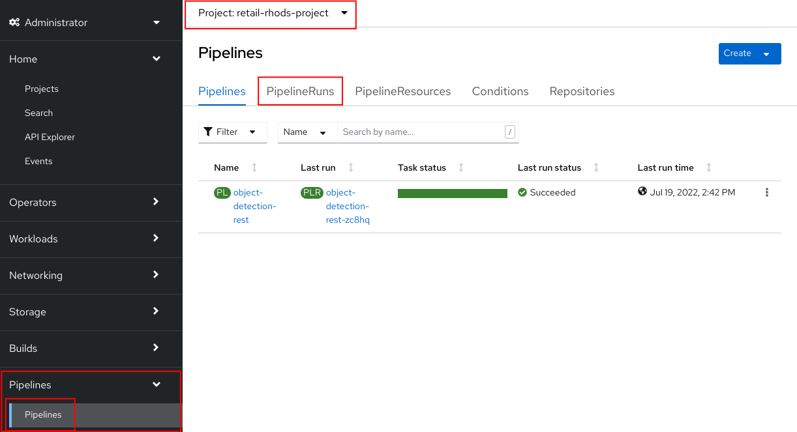
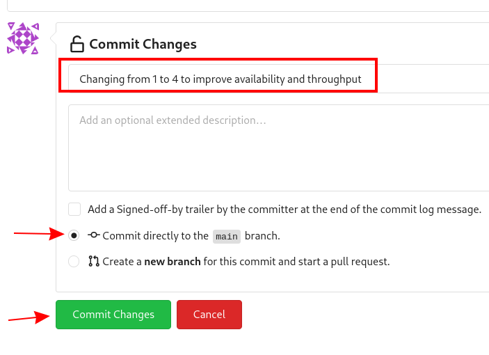

# Retail Application - Workshop Instructions

Toggle Table of Contents

* [Workshop Environment.](#workshop-environment)
  * [For Red Hat Employees:](#for-red-hat-employees)
  * [For the general public:](#for-the-general-public)
* [Accessing and testing your deployed Application](#accessing-and-testing-your-deployed-application)
* [Retraining the model](#retraining-the-model)
  * [Logging into RHODS](#logging-into-rhods)
  * [Git clone the arc-model project](#git-clone-the-arc-model-project)
  * [Retrain the model](#retrain-the-model)
  * [Publish the changes](#publish-the-changes)
* [Reviewing the OpenShift Pipeline](#reviewing-the-openshift-pipeline)
  * [Reviewing the pipeline run](#reviewing-the-pipeline-run)
  * [Retrain the model (again).](#retrain-the-model-again)
  * [Watch the build.](#watch-the-build)
* [Reviewing ArgoCD and GitOps](#reviewing-argocd-and-gitops)
  * [Connecting to OpenShift GitOps](#connecting-to-openshift-gitops)
  * [Attempting a manual change in OpenShift](#attempting-a-manual-change-in-openshift)
  * [Updating things the GitOps way](#updating-things-the-gitops-way)
* [Wrap up of Hands-On](#wrap-up-of-hands-on)

## Workshop Environment.

### For Red Hat Employees:

If you are a Red Hat employee, you can reserve the workshop environment using the [RHPDS](https://rhpds.redhat.com/) system.

### For the general public:

If you do not work for Red Hat, an environment will be provided for you as part of the workshop.

Follow the link found below to claim an environment - simply enter your email (any email belonging to you) and the password will be given during the presentation.

https://demo.redhat.com/workshop/h7bha9

After logging in, you'll be redirected to a site containing all the URLs and logins you'll need to complete the workshop. That page should look like this:

<!-- * [Current link to sheet](https://docs.google.com/spreadsheets/d/12tr4yU-Rhl78suCeFIJqrQyfvimrOv-HA_1IrDtvMeg/edit#gid=0)

To claim an environment, simply enter your name in the first column of any open row containing environment info. This row will now contain all the links and logins you should need to complete our workshop.

If there are no available environments, ____. -->

## Accessing and testing your deployed Application

As part of the bootstrapping of your environment, an initial instance of your application was deployed.
Let's review it and confirm it works as expected.

<!-- 1. Follow the link to your 'OpenShift Console URL'
1. Log in to OpenShift using the username: `user1` and password: `openshift`
1. Select `Administrator` view.
    
1. Navigate to **Networking**, then **Routes**
    * In this tab you will likely get a permissions error. Ignore this error, as following the next instruction (selecting the project) will fix this.
1. Select the project called **retail-rhods-project**
1. You will see a route called **object-detection-app-git**
1. Click on the matching hyperlink
     -->

1. Follow the URL marked as 'Application url'
  
1. This will open the app in your browser
1. You will be prompted to authorize your browser to use your Camera. Allow it to do so.
1. When you take a picture that contains either a piece of clothing, footwear, or a bottle it should display a rebate overlaid on the image.
1. You can also send the URL to your smart phone in order to have a more portable camera than your laptop

We can now move on to the next step.

## Retraining the model

The initial version of the discounting model was built using a dataset called [monday.csv](discount_data/datasets/monday.csv).

In this section, we will:
* log into RHODS
* Clone the project from your on-cluster gitea instance
* Retrain the model with fresher data
* Publish our changes

### Logging into RHODS

* Locate the RHODS-Dashboard URL. (It starts with `https://rhods-dashboard....`)
* Click on "Log in with OpenShift"
* Log in as `user1` with the password `openshift`
* Click **Allow Selected Permissions** to Authorize the access
* Once in the RHODS Dashboard, Click on the **Launch Application** hyperlink in the JupyterHub tile
* Log in as `user1` with the password `openshift`
* Click **Allow Selected Permissions** to Authorize the access
* Choose **Standard Data Science** as the image and **Small** as the Notebook Size
* Click on **Start Server**

### Git clone the arc-model project

Each environment comes with a dedicated instance of Gitea so that each student can easily and independently make updates in the git repo without affecting the others.

* The Gitea URL to use should be provided together with your environment information here:

  

* Once you have the gitea URL:
* Log in to Gitea as user `lab-user` with password `openshift`.
* Navigate to the **arc-model** git repo.
* Copy the Git Clone URL:
  * 
* Navigate back to your JupyterLab tab
* Click on the Git Icon (fourth of the 6 big icons on the left)
* Click on the **Clone a repository** button

  * 

* Paste the URL and click **Clone**
* In the File Explorer menu, double-click on **arc-model** to move to that directory

### Retrain the model

Now that we've cloned the project, let's retrain the model. We will use a notebook to do so.

* Open the Notebook called `5_discount_model.ipynb` from the RHODS file system tab
* This notebook contains the code for training our discount model.
* In the third cell you can see a reference to our "monday" dataset called `discount_data/datasets/monday.csv`
* Update the content of the cell so that it points to our second dataset: `discount_data/datasets/tuesday.csv`
* Select the **Run** menu, then the last option: **Restart Kernel and Run All Cells**

  * 

* Confirm by clicking **Restart**
* Once all the cells have run, you will notice that some of the files in the folder **5_discount_models** have been updated.

### Publish the changes

We have now updated our model files as well as the notebook that was used to generate them. We will push those changes back into our gitea instance, in the `main` branch.

* Open up the notebook called `6_git_commit_and_push.ipynb`
* In the third cell, replace the existing command with:

  `!git add .`
* Once again, run the **Restart Kernel and Run all Cells**
* Doing this will automatically Commit our changes into the local git repo, and then push those commits back into the Gitea instance.

Note that here, we are storing both the code (notebook) and model (*.pkl) in Git. If this were a real production project, we'd probably have a more advanced way of storing the various versions of the model.

## Reviewing the OpenShift Pipeline

In the previous steps, we pushed our changes back into the Gitea repo.

In this environment, an OpenShift pipeline has been configure to automatically run every time something is pushed to Gitea.

### Reviewing the pipeline run

Our dev app should automatically rebuild since that we've pushed our changes to the git repository.

1. Follow the link to your 'OpenShift Console URL' on your page of URLs.
1. Log in to OpenShift using the username: `user1` and password: `openshift`
1. Select `Administrator` view.
    
1. Navigate to **Pipelines** , then **Pipelines** (yes, again), and then go to **PipelineRuns**
    
1. Make sure that the selected project is **retail-rhods-project**
1. You should see a pipeline run that failed on the third step
1. Review the failed step.
1. Our sanitycheck.py program is a safeguard that ensures the discounts are never more than a certain percentage.
1. It would seem that the new version of the model might be too generous with the discount!

### Retrain the model (again).

Let's fix this! Clearly we had a problem with our data - luckily we received the data from wednesday which our data engineers have promised will be correct.

Even more lucky, our pipeline has prevented us from putting a "bad" model into our dev environment. Therefore, we don't even need to worry about rolling back a bad change: the bad change was prevented from happening.

1. Again, go to `5_discount_model.ipynb` notebook in your RHODS tab.
1. Let's use the new data from wednesday, update that same cell as before to now point to `discount_data/datasets/wednesday.csv`.

1. Now, rerun the notebook by clicking **Restart Kernel and Run All** as we did before.
1. This will update the discount model with a new discount model trained on wednesday's data.

We could also run the sanity-check here, but the pipeline will take care of that for us.

5. Run the notebook `6_git_commit_and_push.ipynb` again to commit and push our model changes to our git repo.

### Watch the build.

Let's look at the pipeline build now that we've retrained our model with what should be good data.

1. Navigate back to your OpenShift Console tab.

1. Again, take a look at the PipelineRuns and click on the latest run which should be in progress.

1. We can click on the sanity check step within our pipeline, view the log and see that the model has now passed our predefined tests.

1. After the sanity check passes, the rest of the pipeline can now complete and our app will be redeployed with our changes.

## Reviewing ArgoCD and GitOps

In the previous section, we've seen how the pipeline can help detect potential issues and prevent from implementing "broken" artifacts in our dev environment.

In this section, we will see how OpenShift GitOps is used deploy our application, and then to maintain its state.

### Connecting to OpenShift GitOps

* Among the URLs of your environment, locate the **ArgoCD** one.
* When you first open up that URL, you may get a warning that "your connection is not private".
* Click on **Advanced** and then **Proceed to openshift-gitops.......opentlc.com(unsafe)**.
* You will use the username `admin` and the associated password (provided with the environment details)
* Once you're logged into ArgoCD, explore the 2 apps that you see.

### Attempting a manual change in OpenShift

One way to illustrate the benefits of ArgoCD is to try to perform an ad-hoc change in OpenShift.

* Open the OpenShift Console.
* Navigate to **Workloads** and then **Deployments**.
* You will see that the deployment called `object-detection-rest` currently has a single pod (replica)
* If you click on the 3-dots icon at the end of that line, you can choose to **Edit pod count**.
* Change that `1` into a `5` and click **Save**

By default, ArgoCD will reconcile things every 5 minutes.

In the interest of time, we can trigger this to happen sooner. Let's see how.
* click on the **retail-dev** app
* Once the app is open, click on **APP DIFF**
* Tick the box that says **Compact Diff**
* The difference that you see should make sense
* click on **Sync**
* click **SYNCHRONIZE**

You will see that doing so will reset things to their original values. The diff will go away, and the number of pods for this deployment will go back down to 1.

In fact, you could actually delete a whole lot of things on the OpenShift side, and ArgoCD would re-create them almost as quickly!

### Updating things the GitOps way

So if we did want more replicas, what we have to do is to do it in the Gitea repo, and then get Argo to make that change happen. So let's do that.

* Access gitea again
* Make sure you are logged in as `lab-user` with password `openshift`
* Navigate to the repo called `retail-dev-gitops`
* In this repo, stay in the `main` branch
* Navigate to the file `/base/object-detection-rest-deployment.yaml`
* Edit the file directly in Gitea (using the pencil icon)
* Change the text `replicas: 1` to `replicas: 4`
* Commit the change with a meaningful commit message. For example:
    
* Once that is done, toggle over to Argo and get it to refresh again.
* You will quickly see that the number of pods will have been changed in the target environment as well.

Well, we've finally achieved our change, and it's been implemented in the cluster. As a bonus, we now have very good traceability on who did that change when, and it's also a lot easier to undo it if needed.

## Wrap up of Hands-On

This concludes the hands-on part of this workshop.
Your environment will not persist much longer after the end of the session, so make sure to save anything you wish to keep.

We hope you have enjoyed this hands-on and that you have learned a few new things along the way.

If you have questions, comments, or feedback, feel free to use the Q&A panel to share it back with us.
