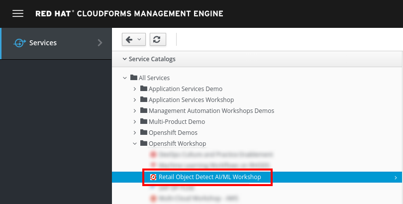
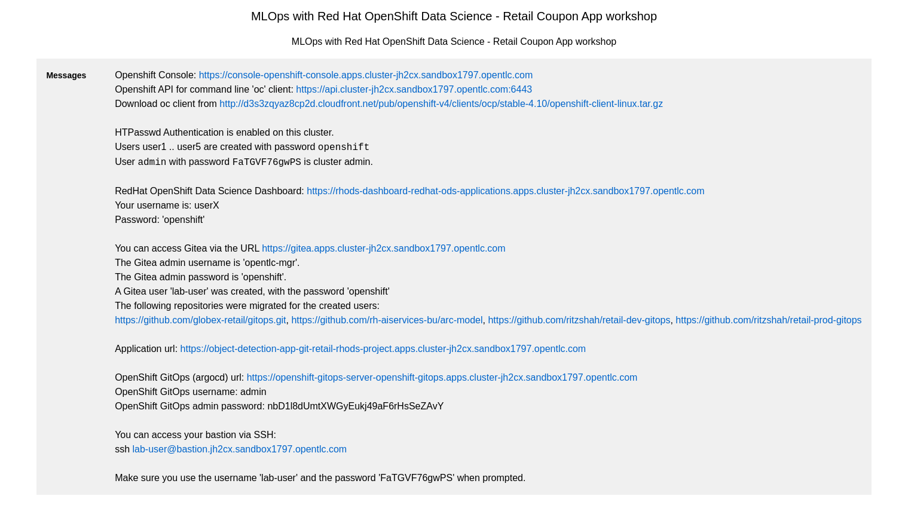
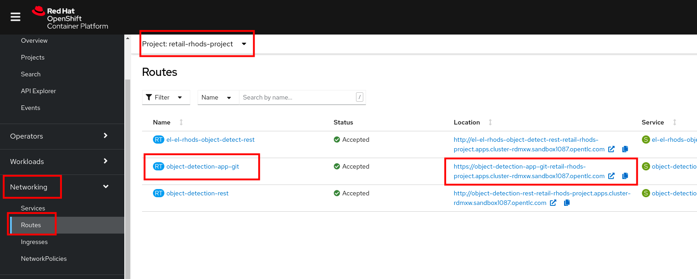
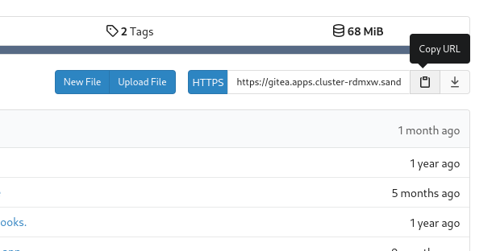

# AR Coupons Workshop - Instructions

* [Workshop Environment.](#workshop-environment)
  * [for Red Hat Employees](#for-red-hat-employees)
  * [for the general public](#for-the-general-public)
* [Accessing and testing your deployed Application](#accessing-and-testing-your-deployed-application)
* [Retraining the model](#retraining-the-model)
  * [Logging into RHODS](#logging-into-rhods)
  * [Git clone the arc-model project](#git-clone-the-arc-model-project)
  * [Retrain the model](#retrain-the-model)
  * [Publish the changes](#publish-the-changes)
* [Reviewing the OpenShift Pipeline](#reviewing-the-openshift-pipeline)
  * [Reviewing the pipeline run](#reviewing-the-pipeline-run)
  * [Retrain the model (again).](#retrain-the-model-again)
  * [Watch the build.](#watch-the-build)
* [GitOps and how it helps to manage ML Model LifeCycle (MLOps way).](#gitops-and-how-it-helps-to-manage-ml-model-lifecycle-mlops-way)

TODOS (priority hi->low):
- fill in instructions left out (will need to launch a lab to do these parts to make sure they're accurate).
- fill in instructions on what to do if we run out of environments.
- update link to sheet to sheet that anyone from outside RH can access.
- add images/screenshots.

## Workshop Environment.

### For Red Hat Employees:

If you are a Red Hat employee, you can reserve the workshop environment using the [RHPDS](https://rhpds.redhat.com/) system.

### For the general public:

If you do not work for Red Hat, an environment will be provided for you as part of the workshop.

Follow [this link](https://demo.redhat.com/workshop/7b85bw) (also found below) to claim an environment - simply enter your email and the password `redhat`.

https://demo.redhat.com/workshop/7b85bw

After logging in, you'll be redirected to a site containing all the URls and logins you'll need to complete the workshop. That page should look like this: 

<!-- * [Current link to sheet](https://docs.google.com/spreadsheets/d/12tr4yU-Rhl78suCeFIJqrQyfvimrOv-HA_1IrDtvMeg/edit#gid=0)

To claim an environment, simply enter your name in the first column of any open row containing environment info. This row will now contain all the links and logins you should need to complete our workshop.

If there are no available environments, ____. -->

## Accessing and testing your deployed Application

As part of the bootstrapping of your environment, an initial instance of your application was deployed.
Let's review it and confirm it works as expected.

1. Follow the link to your 'OpenShift Console URL'
1. Log in using the username and password for the OpenShift `admin` account
1. Navigate to **Networking**, then **Routes**
1. Select the project called **retail-rhods-project**
1. You will see a route called **object-detection-app-git**
1. Click on the matching hyperlink
    
1. This will open the app in your browser
1. You will be prompted to authorize your browser to use your Camera. Allow it to do so.
1. When you take a picture that contains either a piece of clothing, footwear, or a bottle it should display a rebate overlaid on the image.
1. You can also send the URL to your smart phone in order to have a more portable camera than your laptop

We can now move on to the next step.

## Retraining the model

The initial version of the discounting model was built using a dataset called [monday.csv](discount_data/datasets/monday.csv).

In this section, we will:
* log into RHODS
* Clone the project from your on-cluster gitea instance
* Retrain the model with fresher data
* Publish our changes

### Logging into RHODS

* Locate the RHODS-Dashboard URL. (It starts with `https://rhods-dashboard....`)
* Click on "Log in with OpenShift"
* Log in as `user1` with the password `openshift`
* Click **Allow Selected Permissions** to Authorize the access
* Once in the RHODS Dashboard, Click on the **Launch Application** hyperlink in the JupyterHub tile
* Log in as `user1` with the password `openshift`
* Click **Allow Selected Permissions** to Authorize the access
* Choose **Standard Data Science** as the image and **Small** as the Notebook Size
* Click on **Start Server**

### Git clone the arc-model project

Each environment comes with a dedicated instance of Gitea so that each student can easily and independently make updates in the git repo without affecting the others.

* The Gitea URL to use should be provided together with your environment information
* If not:
  * In the OpenShift Console, navigate to **Networking** and then **Routes**
  * Select the project called **gitea**
  * You should see the gitea route under the **Location** column
* Once you have the gitea URL:
* Log in to Gitea as user `lab-user` with password `openshift`.
* Navigate to the **arc-model** git repo.
* Copy the Git Clone URL:
  * 
* Navigate back to your JupyterLab tab
* Click on the Git Icon (fourth of the 6 big icons on the left)
* Click on the **Clone a repository** button
* Paste the URL and click **Clone**
* In the File Explorer menu, double-click on **arc-model** to move to that directory
* Click on the Git Icon
* Change the current branch from from `main` to `origin/dev`

### Retrain the model

Now that we've cloned the project, let's retrain the model. We will use a notebook to do so.

* Open the Notebook called `5_discount_model.ipynb` from the RHODS file system tab
* This notebook contains the code for training our discount model.
* In the third cell you can see a reference to our "monday" dataset called `discount_data/datasets/monday.csv`
* Update the content of the cell so that it points to our second dataset: `discount_data/datasets/tuesday.csv`
* Select the **Run** menu, then the last option: **Restart Kernel and Run All Cells**
* Confirm by clicking **Restart**
* Once all the cells have run, you will notice that some of the files in the folder **5_discount_models** have been updated.

### Publish the changes
monday
We have now updated our model files as well as the notebook that was used to generate them. We will push those changes back into our gitea instance, in the `dev` branch.

* Open up the notebook called **6_git_commit_and_push.ipynb**
* Once again, run the **Restart Kernel and Run all Cells**
* Doing this will automatically Commit our changes into the local git repo, and then push those commits back into the Gitea instance.

Note that here, we are storing both the code (notebook) and model (*.pkl) in Git. If this were a real production project, we'd probably have a more advanced way of storing the various versions of the model.

## Reviewing the OpenShift Pipeline

In the previous steps, we pushed our changes back into the Gitea repo.

In this environment, an OpenShift pipeline has been configure to automatically run every time something is pushed to Gitea.

### Reviewing the pipeline run

Our dev app should automatically rebuild since that we've pushed our changes to the git repository.

1. Log into the OpenShift Console
1. Navigate to **Pipelines** , then **Pipelines** (yes, again), and then go to **PipelineRuns**
1. Make sure that the selected project is **retail-rhods-project**
1. You should see a pipeline run that failed on the third step
1. Review the failed step.
1. Our sanitycheck.py program is a safeguard that ensures the discounts are never more than a certain percentage.
1. It would seem that the new version of the model might be too generous with the discount!

### Retrain the model (again).

Let's fix this! Clearly we had a problem with our data - luckily we received the data from wednesday which our data engineers have promised will be correct.

Even more lucky, our pipeline has prevented us from putting a "bad" model into our dev environment. Therefore, we don't even need to worry about rolling back a bad change: the bad change was prevented from happening.

* Again, go to '5_discount_model.ipynb' notebook in your RHODS tab.
* Let's use the new data from wednesday, update that same cell with 'discount_data/datasets/tuesday.csv'.
* Now, rerun the notebook by clicking 'Restart Kernel and Run All'.
* This will update the discount model with a new discount model trained on wednesday's data.

we could also run the sanity-check here, but the pipeline will take care of that for us.

Run the notebook '6_git_commit_and_push.ipynb' again to commit and push our model changes to our dev git repo.

### Watch the build.

Let's look at the pipeline build in the OpenShift Console tab. We can see the pipeline build will run now, and can take a look at our sanity check step in the pipeline to see the the log and see our model has passed our predefined tests.

## GitOps and how it helps to manage ML Model LifeCycle (MLOps way).

Lets look at CICD process and how if follows the GitOps principles. Also walk through the OpenShift Pipeline and OpenShift GitOps console.

OpenShift Pipeline does continuous integration. Once you push your code/model to your respository, it will automatically trigger pipeline to test the new model, build it and deploy it in dev environment. The OpenShift Pipeline do not have any control over deployment on PROD.

OpenShift GitOps does have control over prod environment, based on the changes to its prod image it will trigger auto deployment of the new image into prod.

You see the CI and CD processes are separately running and OpenShift Pipelines (where dev team works) do not have access to change anything in production project.

Also change in code (e.g. change in image tag in prod using Kustomize) triggers change in prod container update with the new image and new model.

No one touches the production environment directly and updates the image, rather its all followed through change in code, managed through git and completely auditable and reversible if required.
